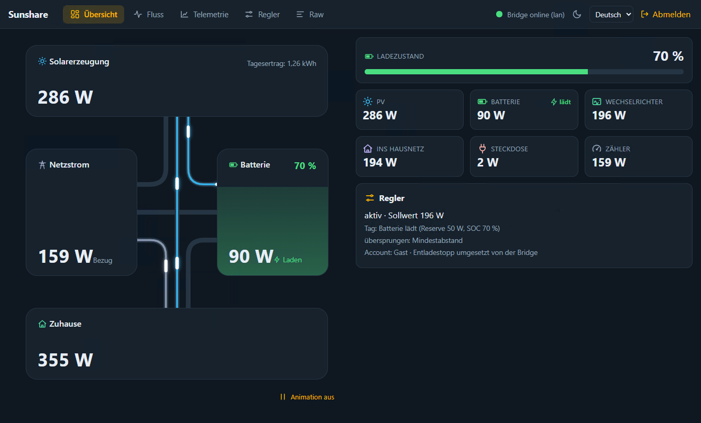
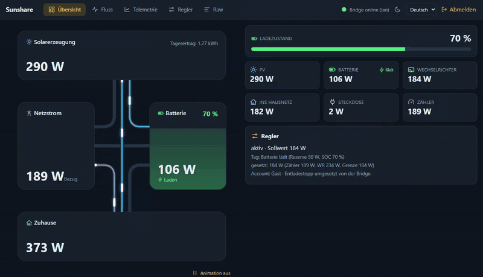
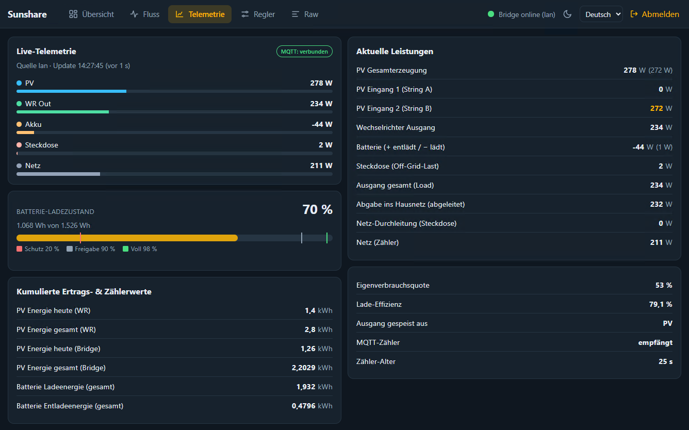
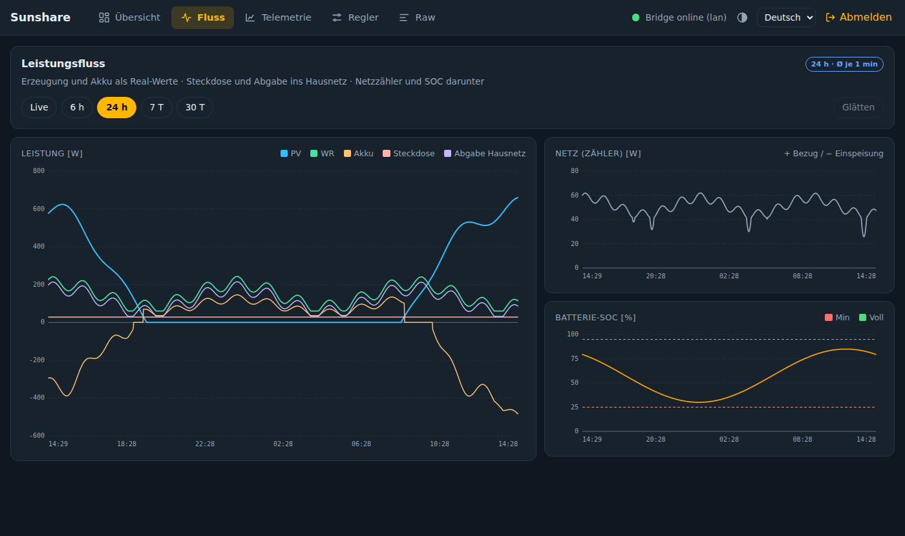
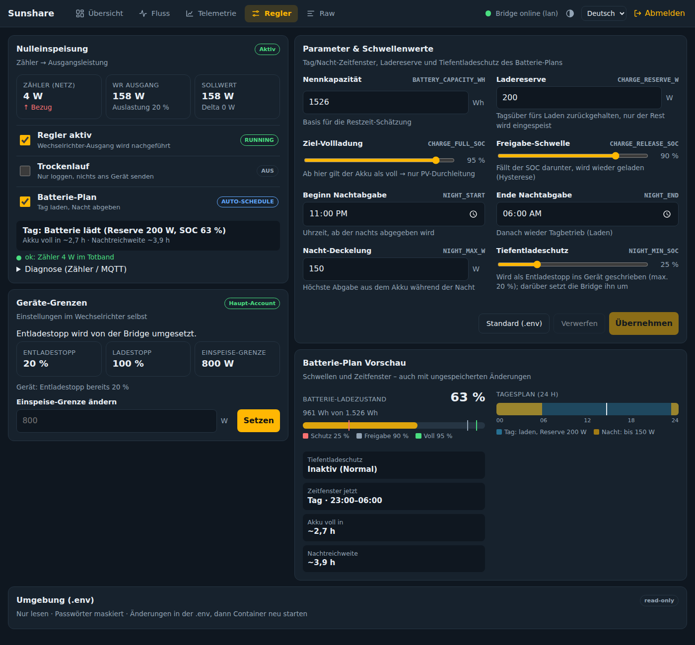
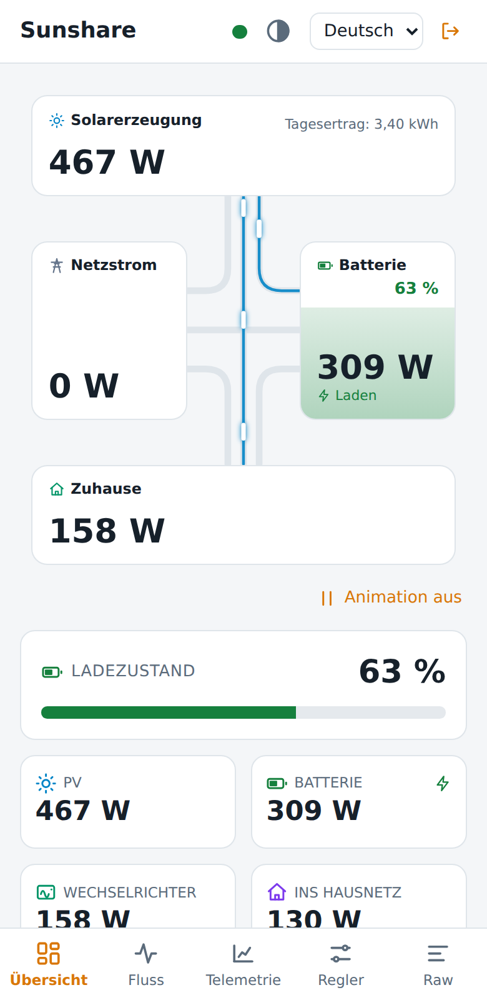

# Sunshare Bridge

Live-Daten, Verlauf und Nulleinspeisung für **Sunshare-Mikro-Wechselrichter mit Batterie** (iShareCloud-App,
`com.sunshare.cloud`) – als Docker-Container mit Web-UI und MQTT/Home-Assistant-Anbindung.

> **Inoffizielles Projekt.** Nicht mit Sunshare/Sunsharetek verbunden. Es nutzt Schnittstellen, die per Reverse
> Engineering am **eigenen Gerät** ermittelt wurden und sich jederzeit ändern können. Nutzung auf eigene
> Verantwortung, ohne Gewähr – der Regler schreibt Werte an dein Gerät. Siehe [Sicherheit](#sicherheit).

**In English (short):** A self-hosted bridge for Sunshare micro-inverters with battery. It reads live data either from
the cloud API or by transparently proxying the inverter's plain-HTTP telemetry push on your LAN, publishes it to MQTT
with Home Assistant discovery, keeps a long-term history (SQLite), offers a web UI (telemetry, power-flow charts, raw
log, controller/parameters) and an optional zero-feed-in controller. Use a dedicated *invited user* account so your
phone app stays logged in. The UI and docs are in German; the code and comments are in English.

## Funktionen

- **Live-Telemetrie** aus zwei Quellen (`DATA_SOURCE`): **`lan`** – das Gerät pusht alle ~3 s Klartext-HTTP an
  Sunshare, ein NAT-Eintrag im Router leitet das über die Bridge (die alles unverändert weiterreicht), oder
  **`cloud`** – Abfrage der (AES-verschlüsselten) Cloud-API.
- **MQTT + Home-Assistant-Discovery**: Sensoren erscheinen automatisch, inkl. Energiezähler fürs Energy-Dashboard.
- **Web-UI** (Port 8099, React-App und PWA): animiertes Energiefluss-Diagramm · Leistungsfluss-Charts (Live und bis
  30 Tage) · Telemetrie & Erträge · Roh-Log der Geräte-Pushes · Regler & Batterie-Plan · Login, Hell/Dunkel, Deutsch/Englisch.
- **Langzeit-Verlauf**: ein Mittelwert pro Minute in SQLite, Aufbewahrung einstellbar.
- **Nulleinspeisung** (optional, standardmäßig aus): führt die Ausgangsleistung anhand eines Netzzählers nach, mit
  Batterie-Plan (tagsüber laden, nachts kontrolliert abgeben). Trockenlauf zum Ausprobieren.
- Abgeleitete Werte: Abgabe ins Hausnetz, Lade-Effizienz, „Ausgang gespeist aus Akku/PV/Netz“.

## Screenshots

**Dashboard** – Energiefluss mit einer Leitung pro Paar (hier: Solar lädt die Batterie, das Netz versorgt das Haus), Kacheln, Reglerstatus:



Der Fluss in Bewegung (die hellen Impulse laufen in Flussrichtung, Tempo und Dicke folgen der Leistung; [als MP4](docs/img/dashboard.mp4)):



**Telemetrie** – Live-Leistungen, Batterie-SOC mit Schwellen, Erträge, Lade-Effizienz, „Ausgang gespeist aus …“:



**Fluss** – Leistung, Netzzähler und Batterie-SOC, hier die letzten 24 Stunden:



**Regler** – Nulleinspeisung, Parameter, Geräte-Grenzen, Plan-Vorschau und die `.env` (einklappbar, schreibgeschützt):



**Handy / PWA** (hell):



_Dashboard, Animation und Telemetrie sind Aufnahmen einer laufenden Bridge; Fluss, Regler und Handy zeigen Beispieldaten._

## Voraussetzungen

- Docker (Compose) auf einem Rechner im selben LAN wie der Wechselrichter, ein MQTT-Broker (z. B. Mosquitto/Home
  Assistant).
- Für `DATA_SOURCE=lan`: ein Router, der Ziel-NAT pro Quell-IP kann (Anleitung für UniFi unten). Ohne Router-Eingriff
  geht `DATA_SOURCE=cloud`.
- Für den Regler: ein Netzzähler, der per MQTT veröffentlicht wird (positiv = Bezug).

## Schnellstart

### 1. Account: eingeladenen Nutzer verwenden

Sunshare erlaubt **eine aktive Session pro Account**. Melde die Bridge deshalb **nicht mit deinem Haupt-Account** an,
sondern lege einen **zweiten Account** an und **lade ihn in der iShareCloud-App zu deinem Gerät ein**. Ein
eingeladener Nutzer-Account reicht der Bridge aus – die Handy-App mit dem Hauptaccount bleibt eingeloggt. (Mit dem
Haupt-Account würden sich Bridge und App gegenseitig rauswerfen.)

### 2. Gerät finden

```bash
cp .env.example .env
# SUNSHARE_USER_ACCOUNT / SUNSHARE_PASSWORD in .env eintragen (der eingeladene Account), dann:
python3 scripts/sunshare_login.py devices       # zeigt "id" und "sn" deines Geräts
```

Trag `id` als `SUNSHARE_DEVICE_ID` und `sn` als `SUNSHARE_DEVICE_SN` in die `.env` ein, dazu `MQTT_HOST` (und ggf.
Benutzer/Passwort). Alle Optionen stehen kommentiert in [`.env.example`](.env.example).

### 3. Starten

```bash
docker compose up -d --build
```

Web-UI: `http://<docker-host>:8099`. In Home Assistant erscheint unter MQTT das Gerät **„Sunshare Inverter“**.

### 4. Datenquelle wählen

- **`cloud`** (`DATA_SOURCE=cloud`): funktioniert sofort, die Bridge fragt die Cloud alle 2 s ab.
- **`lan`** (Default): braucht die [NAT-Regel](#unifi-nat-regel-für-lan-modus). Vorteil: die Werte kommen direkt vom
  Gerät, ohne Cloud-Abfrage.

In beiden Fällen läuft ein Keepalive (`openRealTime`) gegen die Cloud – ohne ihn pusht das Gerät keine Live-Daten.

## Versionierung

CI baut bei jedem Push nach `main` das Image `ghcr.io/kurim/sunshare-bridge:latest` (aktueller Entwicklungsstand)
und veröffentlicht es. Ein Release entsteht durch einen Git-Tag im Format `vX.Y.Z`:

```bash
git tag v1.0.0
git push origin v1.0.0
```

Das baut zusätzlich `ghcr.io/kurim/sunshare-bridge:v1.0.0` (fest) und `ghcr.io/kurim/sunshare-bridge:stable` (zeigt
immer auf das jeweils neueste Release-Tag, nie auf `main`). Um ein veröffentlichtes Image statt eines lokalen Builds
zu verwenden, in `docker-compose.yml` `build: .` durch z. B. `image: ghcr.io/kurim/sunshare-bridge:stable` ersetzen.
Ist das GHCR-Paket noch privat, einmalig in den Paket-Einstellungen auf GitHub auf öffentlich stellen (oder vorher
`docker login ghcr.io` mit einem Token, das `read:packages` hat). Die laufende Version steht auf der Login-Seite
und in der Kopfzeile der Web-UI; Änderungen je Release stehen in [`CHANGELOG.md`](CHANGELOG.md).

## Web-UI

`http://<docker-host>:8099/` (leitet nach `/app/`) – React-App, für das Handy gebaut und als **PWA**
installierbar (Manifest, Service Worker, Safe-Area-Layout, Hell/Dunkel nach Systemeinstellung).

| Seite | Inhalt |
|---|---|
| **Übersicht** `/app/` | Animiertes Energiefluss-Diagramm (Solar, Netz, Batterie, Zuhause; jeder Knoten hat drei Anschlüsse, eine Leitung pro Paar, und es leuchtet nur die Leitung, über die die Energie fließt – z. B. Solar → Batterie und Netz → Zuhause. Ein farbiger Kern mit hellen Leuchtimpulsen läuft in Flussrichtung, Tempo und Dicke folgen der Leistung; Knopf „Animation an/aus“ überstimmt die Systemeinstellung „Bewegung reduzieren“), Ladezustand mit Farbe, Leistungskacheln, Reglerstatus, Login-Fehler der Sunshare-Cloud |
| **Fluss** `/app/flow` | Charts für Leistung, Netzzähler und SOC: Live (mit Glättung) oder 6 h · 24 h · 7 T · 30 T aus dem Verlauf; Tooltip per Maus/Touch, Lücken als Unterbrechung |
| **Telemetrie** `/app/telemetry` | Live-Leistungen, SOC mit Schwellen, Erträge und Zähler, Lade-Effizienz, „Ausgang gespeist aus …“ |
| **Regler** `/app/control` | Regler/Trockenlauf/Plan, Parameter, Plan-Vorschau, Geräte-Grenzen, `.env`-Ansicht |
| **Raw** `/app/raw` | Jeder Push des Geräts unverändert samt Antwort des Servers, Feldübersicht, Filter, Pause, JSON-Download (nur im Speicher, `RAW_LOG_SIZE`) |

**Desktop und Handy:** Auf dem Desktop liegt die Navigation (mit Icons) in der Kopfzeile und die Seiten nutzen die volle
Breite in zwei Spalten; auf dem Handy gibt es eine Leiste unten mit Icons über den Labels.

**Darstellung:** Hell, Dunkel oder Automatisch (folgt der Systemeinstellung, auch wenn sie sich zur Laufzeit ändert) –
Umschalter (Sonne/Mond/Halbkreis) oben rechts, die Wahl wird im Browser gemerkt und beim Laden ohne Aufblitzen angewendet;
die Farbe der Titelleiste der PWA folgt ihr.

**Sprachen:** Deutsch und Englisch, umschaltbar oben rechts (die Wahl wird im Browser gemerkt, Voreinstellung nach
Browser-Sprache). Eine weitere Sprache: `frontend/src/i18n/en.ts` nach `<code>.ts` kopieren, die Werte übersetzen und
die Sprache in `frontend/src/i18n/index.tsx` eintragen (`LANGUAGES`, plus Import in `CATALOGS`). Der Build prüft, dass
Schlüssel und `{Platzhalter}` vollständig sind. Auch die Texte der Bridge (Reglerphase, letzte Aktion, Geräte-Hinweise,
Fehler bei ungültigen Parametern, Login-Fehler, Gruppen der `.env`-Ansicht) werden übersetzt: die Bridge sendet Schlüssel und
Parameter (`app/messages.py`), die Oberfläche macht den Satz daraus; in Logs und API-Fehlern steht der englische Text.

**Als App installieren (PWA):** über HTTPS (z. B. Cloudflare Tunnel; Service Worker und Installation brauchen das). iPhone:
Safari → Teilen → „Zum Home-Bildschirm“, Android/Chrome: „App installieren“. Der Service Worker cached nur die App-Shell,
Daten kommen immer live von der Bridge. Ändert sich das Meta-Tag `apple-mobile-web-app-status-bar-style` oder das Manifest,
muss die App unter iOS einmal vom Home-Bildschirm entfernt und neu hinzugefügt werden (iOS liest es beim Hinzufügen).
Beim Start zeigt iOS ein **Startbild** (Sonne und Name, hell oder dunkel je nach Systemeinstellung) für alle gängigen iPhones und
iPads (`frontend/public/splash/`, erzeugt mit `python3 frontend/scripts/make-splash.py`, braucht Pillow; neue Geräte in der Liste
`DEVICES` ergänzen). Auch das liest iOS nur beim Hinzufügen zum Home-Bildschirm.
Die iOS-27-Beta weichzeichnet den oberen Rand installierter PWAs; die App legt dort auf dem iPhone einen 16 px hohen Streifen in
der Header-Farbe an und schiebt die Seite darunter (`#status-bar-tint`, Kniff aus einer Diskussion auf r/PWA).

Die Live-Verbindung wird geschlossen, solange die App im Hintergrund ist, und beim Zurückkehren wieder geöffnet.
Ohne `UI_USER`/`UI_PASSWORD` zeigt die App einen Hinweis, dass kein Login eingerichtet ist (siehe [Sicherheit](#sicherheit)).

Die Adressen der früheren Oberfläche (`/`, `/flow`, `/control`, `/raw`) leiten auf die entsprechenden Seiten der App weiter.

## Home Assistant

Nach dem Start werden per Discovery Sensoren angelegt (Auszug):

- Leistungen (W): `PV Power`, `PV1/PV2 Power`, `Inverter Output Power`, `Battery Power`,
  `Battery Charge/Discharge Power`, `Load Power`, `Off-Grid Socket Power`, `Feed-in to House Grid (derived)`,
  `Grid Power`; `Battery SOC` (%).
- **„Real“-Werte** (ungefilterte Rohwerte des Geräts): `PV Power (real)`, `Battery Power (real)`,
  `Inverter Output Power (real)`. `PV Power` liegt bei Schwachlicht unter der echten PV-Leistung (im Test ~15 %);
  siehe [`docs/DEVICE_NOTES.md`](docs/DEVICE_NOTES.md).
- Energie (kWh, `total_increasing`): `PV Energy Today/Lifetime` (vom Gerät), `PV Energy Today/Total (Bridge)`,
  `Battery Charge Energy`, `Battery Discharge Energy` (von der Bridge aus der Leistung integriert – das Gerät hat
  dafür keinen eigenen Zähler).

**Energy-Dashboard:** `PV Energy Today/Lifetime` bzw. `PV Energy Total (Bridge)` als *Energie der PV-Erzeugung*,
`Battery Charge/Discharge Energy` unter *Batteriesystem*, `Battery Charge/Discharge Power` als optionale
*Leistungsmessung* („Zwei Sensoren“).

## Nulleinspeisung und Batterie-Plan

Der Regler liest einen Netzzähler aus MQTT und stellt die Ausgangsleistung des Wechselrichters (`permPower`) so ein,
dass der Zähler ~0 W zeigt. Er ist **aus und im Trockenlauf**, bis du ihn im UI unter *Regler & Parameter* aktivierst
(echte Schreibzugriffe brauchen eine Bestätigung). Ohne konfigurierten Zähler bleibt er untätig.

1. Zähler konfigurieren: `METER_CONFIG_TOPIC` (Home-Assistant-Discovery-Topic des Zählers) **oder**
   `METER_STATE_TOPIC` (+ `METER_VALUE_PATH`), siehe `.env.example`.
2. Im UI zuerst **Trockenlauf** aktivieren und im Regelstatus prüfen, was der Regler tun würde.
3. **Batterie-Plan** (optional): tagsüber lädt die Batterie mit einer Reserve (`CHARGE_RESERVE_W`) bis
   `CHARGE_FULL_SOC`, danach wird nur PV durchgereicht; nachts wird bis `NIGHT_MAX_W` abgegeben, solange der SOC über
   `NIGHT_MIN_SOC` liegt. Alle Parameter sind im UI einstellbar; die `.env`-Werte sind nur die Defaults.
4. **Einspeise-Schutz:** Meldet der Zähler eine Einspeisung (negativer Wert), hebt der Regler `CHARGE_RESERVE_W`
   sofort um genau diesen Betrag an (Obergrenze 2000 W), damit die nächste Runde mehr PV der Batterie statt der
   Ausgabe zuweist. Bleibt die Einspeisung danach aus, senkt der Regler die Anhebung träge wieder ab (alle 10 Minuten
   um 10 W) und nie unter den von dir eingestellten Wert – eine manuelle Änderung der Reserve im UI setzt diesen
   Basiswert neu.

## Konfiguration

Alles über `.env` (Vorlage: [`.env.example`](.env.example)). Wichtigste Variablen:

| Variable | Bedeutung |
|---|---|
| `SUNSHARE_USER_ACCOUNT`, `SUNSHARE_PASSWORD` | Account der Bridge (eingeladener Nutzer empfohlen) |
| `SUNSHARE_USER_GUEST` | `TRUE` (Default): eingeladener Account, `NIGHT_MIN_SOC` setzt nur die Bridge um. `FALSE`: Haupt-Account, `NIGHT_MIN_SOC` wird zusätzlich als Entladestopp (`socMin`, max. 20 %) ins Gerät geschrieben und die Einspeise-Grenze `countryMaxPower` ist änderbar (Schreiben nur bei aktivem Regler ohne Trockenlauf) |
| `SUNSHARE_DEVICE_ID`, `SUNSHARE_DEVICE_SN` | aus `scripts/sunshare_login.py devices` |
| `MQTT_HOST`, `MQTT_PORT`, `MQTT_USERNAME`, `MQTT_PASSWORD`, `MQTT_BASE_TOPIC` | MQTT-Broker (Default-Port 1883, Topic `sunshare`) |
| `DATA_SOURCE` | `lan` (Default) oder `cloud` |
| `HISTORY_RETENTION_DAYS` | Aufbewahrung des Verlaufs (Default 30) |
| `RAW_LOG_SIZE` | Größe des Roh-Log-Puffers (Default 500) |
| `METER_CONFIG_TOPIC` / `METER_STATE_TOPIC` / `METER_VALUE_PATH` | Netzzähler für den Regler |
| `CONTROL_*` | Regelparameter (Ziel, Totband, Verstärkung, Grenzen, Failsafe) |
| Batterie-Plan (`BATTERY_CAPACITY_WH`, `CHARGE_*`, `NIGHT_*`) und `CONTROL_METER_MAX_AGE` (Zähler-Frische, wie oft dein Zähler meldet) | Defaults, im UI überschreibbar |
| `TZ` | Zeitzone (Default `Europe/Berlin`) – bestimmt u. a. den Tageswechsel des PV-Tageszählers |

Persistente Daten liegen in `./data` (Energiezähler, Verlauf, Regler-Einstellungen). Ändern sich `UI_PORT`/`LAN_PORT`,
müssen die Port-Zuordnungen in `docker-compose.yml` angepasst werden.

## UniFi-NAT-Regel für LAN-Modus

Der Wechselrichter sendet seine Telemetrie an `web.sunsharetek.com:80`. Ein NAT-Eintrag leitet **nur den Traffic der
Geräte-IP** auf den Container um; die Bridge reicht alles unverändert an den echten Host weiter, für die App und
Sunshare ändert sich nichts.

Wichtig: **nicht** die DNS-Auflösung fürs ganze Netz ändern – sonst landet auch der HTTPS-Traffic deines Handys auf
der Bridge, den sie nicht transparent durchreichen kann. Die Regel muss auf die **Quell-IP des Wechselrichters**
beschränkt sein.

**Vorbereitung:** Vergib dem Gerät eine feste IP (DHCP-Reservierung).

**SSH auf UDM/UDM-Pro/Cloud-Gateway, persistente `on_boot.d`-Regel** (überlebt Reboots/Firmware-Updates):

```bash
ssh root@<unifi-router-ip>
mkdir -p /data/on_boot.d
cat > /data/on_boot.d/10-sunshare-nat.sh <<'EOF'
#!/bin/sh
DEVICE_IP="192.168.1.50"    # feste IP des Wechselrichters
PROXY_IP="192.168.1.20"     # IP des Docker-Hosts mit der Bridge
iptables -t nat -C PREROUTING -s "$DEVICE_IP" -p tcp --dport 80 \
  -j DNAT --to-destination "$PROXY_IP:80" 2>/dev/null || \
iptables -t nat -A PREROUTING -s "$DEVICE_IP" -p tcp --dport 80 \
  -j DNAT --to-destination "$PROXY_IP:80"
EOF
chmod +x /data/on_boot.d/10-sunshare-nat.sh
sh /data/on_boot.d/10-sunshare-nat.sh   # einmal sofort anwenden
```

Liegen Geräte-IP und Docker-Host in unterschiedlichen VLANs/Subnetzen, zusätzlich eine `MASQUERADE`-Regel in
`POSTROUTING` einplanen. Andere Router: das Prinzip ist ein Ziel-NAT `Quell-IP des Geräts, TCP 80 → Docker-Host:80`.
Prüfen: `LOG_LEVEL=DEBUG` setzen und `docker compose logs -f` – eingehende Telemetrie sollte erscheinen, oder die
**Raw**-Seite der UI zeigt die Pushes.

## Sicherheit

- Die Web-UI kann (über den Regler) die Ausgangsleistung deines Geräts ändern. **Ohne** `UI_USER`/`UI_PASSWORD` hat
  sie **keine Authentifizierung** – dann nur im vertrauenswürdigen LAN betreiben. **Mit** beiden Variablen verlangt
  die gesamte UI und API (auch der Live-Stream) eine Anmeldung: ein Benutzer, Session-Cookie (`HttpOnly`,
  `SameSite=Strict`, `Secure` hinter https, 30 Tage), Sperre nach 5 Fehlversuchen, Schreibzugriffe mit fremdem
  `Origin` werden abgelehnt. Ein Passwortwechsel meldet alle Sitzungen ab.
- **Zugriff von unterwegs (z. B. Cloudflare Tunnel):** Den Tunnel nur auf den **UI-Port** (`http://sunshare-bridge:8099`
  bzw. `localhost:8099`) zeigen lassen, **nie** auf den LAN-Port 80. Vorher `UI_USER`/`UI_PASSWORD` setzen (langes
  Passwort). PWA-Installation und Service Worker brauchen https, das der Tunnel liefert. Die Live-Anzeige nutzt
  Server-Sent Events; Cloudflare reicht sie durch (die Bridge sendet alle 15 s einen Keepalive). Wer zusätzlich
  Cloudflare Access davorschaltet, bekommt eine zweite Hürde.
- Die Seite **Raw** zeigt die Geräte-Pushes inkl. Seriennummer. Vor dem Teilen von Screenshots oder Mitschnitten
  Seriennummer, Geräte-ID und IPs entfernen.
- Zugangsdaten gehören nur in die `.env` (steht in `.gitignore`), nie in Issues oder Logs.
- Der Telemetrie-Push des Geräts ist unverschlüsseltes HTTP; die Bridge verändert ihn nicht.
- **OTA-/Firmware-Endpunkte** (`app/sysOtaVersion/*`) der Sunshare-API nie gegen ein echtes Gerät testen
  (Brick-Risiko).

## Grenzen

- Nur an Geräten mit 2 PV-Eingängen, Batterie und Steckdosen-Ausgang getestet; andere Modelle können andere Felder
  liefern (siehe **Raw**-Seite).
- Der Wechselrichter sendet nur, solange die Bridge (oder die App) eine Real-Time-Session offenhält.
- Die Sunshare-Schnittstellen sind nicht dokumentiert und können sich ändern.

## Entwicklung

```bash
pip install -r requirements.txt -r requirements-dev.txt
pytest

# React-Oberfläche (Vite + TypeScript, Node ≥ 20): gebaut wird sie im Docker-Build (Multi-Stage), lokal so:
cd frontend && npm ci && npm run build    # Ausgabe: frontend/dist, wird unter /app/ ausgeliefert
npm run dev                               # Dev-Server, Proxy auf die Bridge (BRIDGE_URL, Default http://localhost:8099)
```

Architektur und Konventionen: [`CLAUDE.md`](CLAUDE.md). Gerätewissen (Endpunkte, Datenfelder, Beobachtungen):
[`docs/DEVICE_NOTES.md`](docs/DEVICE_NOTES.md). Beiträge sind willkommen – bitte keine echten Zugangsdaten,
Seriennummern oder unbereinigten Mitschnitte in Issues/PRs.

## Danksagung und Lizenz

Die Basis-Endpunkte und die Verschlüsselung stammen aus dem Reverse-Engineering von
[DelphiXE5/homeassistant-sunshare](https://github.com/DelphiXE5/homeassistant-sunshare) (eine fertige
Home-Assistant-Integration für dasselbe Gerät); die Erkenntnisse zu den Datenfeldern kamen aus eigenen Mitschnitten.

Lizenz: [MIT](LICENSE).
